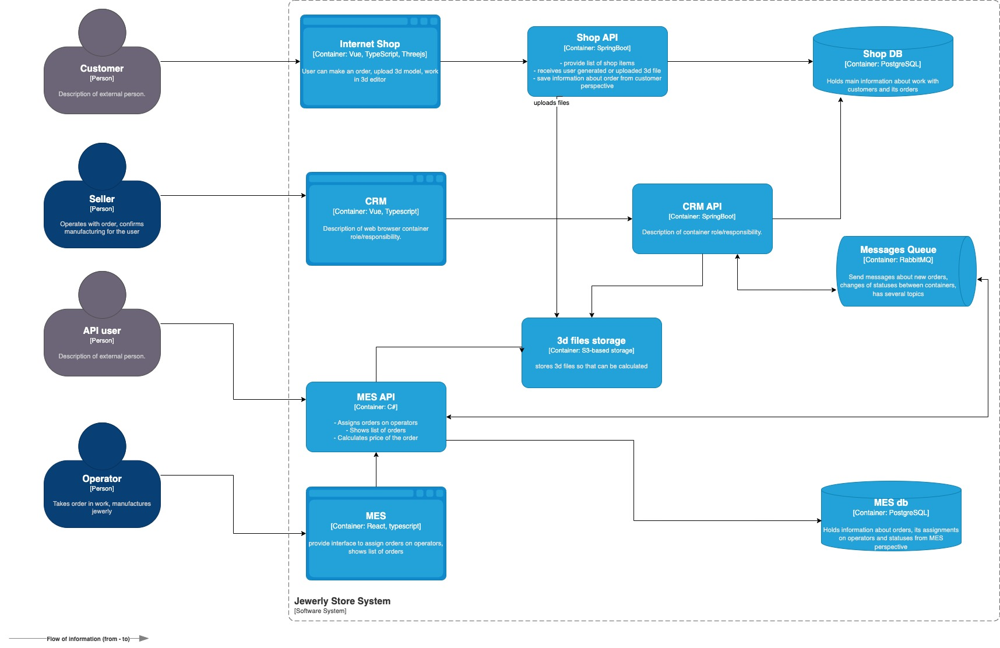

# Планирование: анализ, идентификация проблем и поиск решений

## Текущая ситуация (исходные данные)

### Как устроена архитектура

Система состоит из трёх приложений:
Онлайн-магазин — написан на Vue и Java Spring Boot.
CRM — SPA-приложение, фронтэнд написан на Vue, бэкенд — на Java Spring Boot.
MES — SPA-приложение, фронтенд написан на React, бэкенд — на C#.
Во всех приложениях есть аутентификация и авторизация. Договоримся, что там проблем нет. Вы можете не брать во внимание эту функциональность при работе над заданием.
Вот схема текущей архитектуры в модели C4:

Окружений всего три: dev, release и prod. 

Если говорить про инфраструктуру, то сервис начинался как on-premise. Сейчас всё уже перенесли в облако. Каждый из инстансов крутится как EC2, базы данных — это Managed services на Yandex Cloud. Каждое приложение имеет по одному инстансу. Базы данных имеют один инстанс, который работает на запись и на чтение.

CI/CD реализован так:

Деплой в dev-окружение осуществляется автоматически после мёрджа пул-реквеста и прохождения юнит-тестов.
В release-окружения версию деплоят вручную.
В продакшн версию тоже деплоят вручную.

### Статусы заказа

Вот описание статусов заказа. В скобках указана система, в которой происходит изменение:

- `INITIATED` [онлайн-магазин] — пользователь завёл новый заказ или положил товары в пустую корзину.
- `FILE_UPLOADED` [онлайн-магазин] — пользователь загрузил файл с 3D-моделью или создал его с помощью конструктора.
- `SUBMITTED` [онлайн-магазин] — пользователь нажал на кнопку «Сделать заказ».
- `PRICE_CALCULATED` [MES] — система посчитала стоимость заказа.
- `MANUFACTURING_APPROVED` [CRM] — заказ подтверждён, его можно отдавать в производство.
- `MANUFACTURING_STARTED` [MES] — оператор взял заказ в работу.
- `MANUFACTURING_COMPLETED` [MES] — оператор выполнил заказ.
- `PACKAGING` [MES] — оператор начал упаковывать заказ.
- `SHIPPED` [MES] — заказ отправлен покупателю.
- `CLOSED` [CRM] — заказ завершён. Он закрывается после получения сообщения от транспортной компании или вручную.

### Кто есть в команде

В инженерной команде, кроме вас, работает ещё восемь человек:

- Фронтенд — два инженера Vue, один частично знает React.
- Бэкенд — два инженера Java, один разработчик на C#.
- QA — один инженер по ручному тестированию, хочет заняться автоматизацией и уже делал несколько прототипов.
- Тимлид — бывший разработчик на C#.
- Продакт-менеджер — общается с бизнесом, отвечает за поддержку приложения.
- Один DevOps-инженер.

На стороне бизнеса в «Александрите» работают:

- Продавцы — это пользователи CRM.
- Операторы — пользователи MES.
- Администраторы — к ним относятся продакт-менеджер, тимлид и менеджеры по продажам.
- Учитывайте, что наём потенциально активный. Компания может набрать ещё людей, но нужно обосновать, кто и зачем нужен.

### Как выстроены процессы

Команда выпускает софт двухнедельными спринтами. Есть тестовое окружение, на нём QA-инженер прогоняет E2E-сценарии вручную. Если он обнаруживает баги уровня high или highest, то версию не деплоят на продакшн до их починки. Это часто приводит к значительным задержкам релиза. Раньше задержки не превышали одного месяца, но в последнее время требуется всё больше и больше времени.
Обсудили проблемы компании и текущее архитектурное решение. Теперь перейдём к заданиям.

## Анализ, идентификация проблем и решений, планирование

### Анализ схемы и описание системы

Идентифицируйте существующие и потенциальные проблемные места. Напишите их список.

### Инициативы, которые необходимы для устранения нежелательных ситуаций

Запишите их в список.

## Приоритетность инициатив

Опишите ход своих рассуждений и ответьте на вопросы:
- Какой вы видите целевую архитектуру через полгода?
- Если бы у вас была возможность выполнить только три пункта из списка инициатив в ближайшие полгода, что бы вы выбрали и почему? Не обязательно добавлять в список только эпики. Вы можете включить в план как крупные изменения, так и локальные задачи.