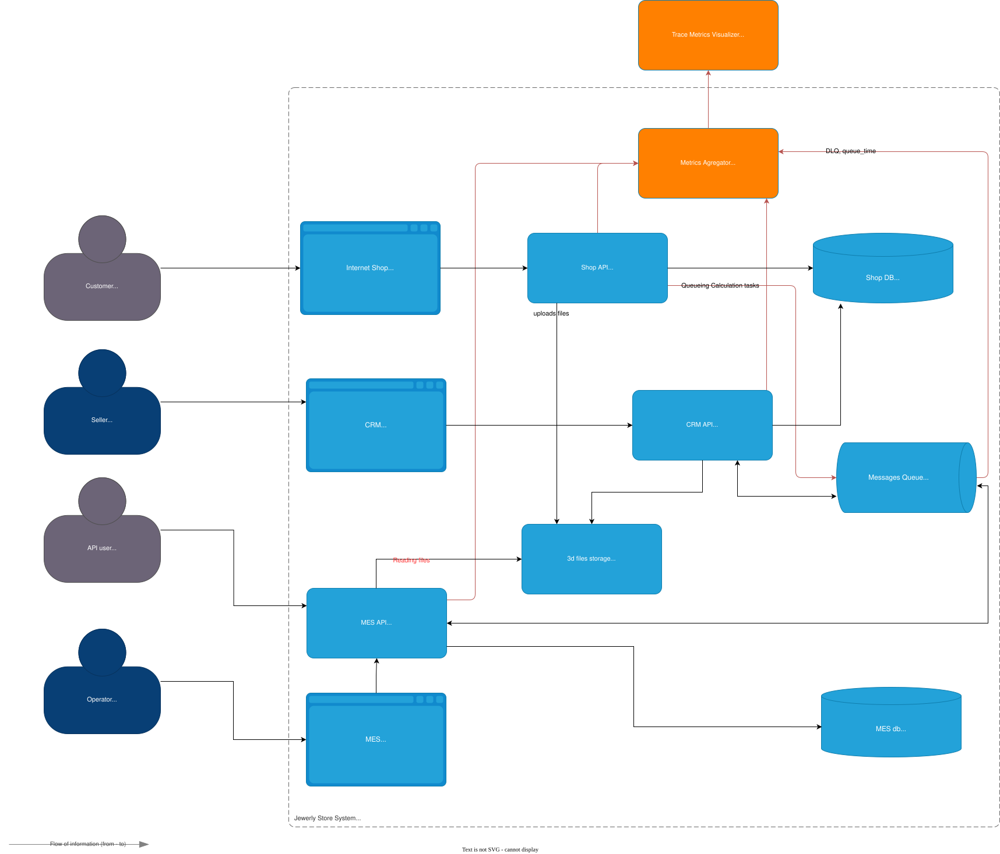

# Архитектурное решение по трейсингу

Команда видит, что заказы часто находятся в непонятном состоянии или зависают на каком-то сервисе внутри IT-ландшафта. Проблемы с заказами могут появляться и вовсе только потому, что сообщения теряются.

Вам необходимо внедрить инструмент, с помощью которого команда сможет увидеть, что происходило с заказом и где он находится сейчас.

## Проанализируйте систему компании и C4-диаграмму в контексте планирования трейсинга

> Напишите и выделите на схеме системы, которые следует покрыть трейсингом. Для этого идентифицируйте места, где заказ может «сломаться» или зависнуть.
> Составьте список данных, которые должны попадать в трейсинг

[Схема для рассмотрения в drawio](../jewerly_c4_model.drawio)

### 1. Анализ: где заказ может «сломаться»

| № | Узел / переход                                                      | Возможная проблема                                                         |
| -- | ------------------------------------------------------------------------------ | ------------------------------------------------------------------------------------------- |
| 1  | `Internet Shop → Shop API` (`SUBMITTED`)                              | HTTP‑ошибка, дед‑тайм‑аут, потеря trace‑id                        |
| 2  | `Shop API → RabbitMQ → MES API` (задача расчёта)        | Сообщение застряло в очереди, неверный routingKey, DLQ     |
| 3  | `MES API → S3 storage → MES worker`                                 | Файл не загрузился / воркер упал → нет `PRICE_CALCULATED` |
| 4  | `MES API → RabbitMQ → CRM API` (`PRICE_CALCULATED`)                | Потеря сообщения,`CRM` откатилась, `5xx`                       |
| 5  | `CRM API → CRM DB` (`MANUFACTURING_APPROVED`)                         | Транзакционная ошибка, dead‑lock                                       |
| 6  | `MES dashboard → MES API` (`MANUFACTURING_STARTED`/`COMPLETED`)     | Большая задержка ответа; фронт не передал header         |
| 7  | `MES API → RabbitMQ → CRM API → CRM DB` (`SHIPPED`/`CLOSED`) | Неверная корреляция заказов, потеря статуса           |

Вывод: трассировать нужно весь «сквозной» путь заказа:
`Internet‑Shop ⇄ Shop‑API ⇄ RabbitMQ ⇄ MES‑API (⇄ MES-DB) ⇄ MES‑worker/S3  ⇄ RabbitMQ ⇄ CRM‑API ⇄ CRM‑DB`.

### 2. Данные, попадающие в трейсинг

| Категория             | Обязательные поля (спаны / события)                                             |
| ------------------------------ | ----------------------------------------------------------------------------------------------------------- |
| Корреляция           | `trace_id`, `span_id`, `parent_span_id`, `order_id`, `message_id`, `routing_key`, `source`    |
| Время                     | `timestamp_start`, `duration_ms`, `queue_time_ms`                                                     |
| Статус                   | `status_code` (`OK`, `ERROR`, `TIMEOUT`), `http_code`, `exception`                              |
| Бизнес‑контекст | `order_status_before`/`after`, `customer_type` (site/api), `polygon_count_bucket`, `file_size_mb` |
| Инфраструктура   | `service_name`, `instance_id`, `host`, `region`                                                     |

## Мотивация

> Напишите здесь, почему в систему нужно добавить трейсинг и что это даст компании. Опишите возможные три-пять технические и бизнес-метрики решения, на которые повлияет внедрение трейсинга.

| Метрика (до / после)                            | Ожидаемый эффект                                                                                   |
| --------------------------------------------------------------- | ----------------------------------------------------------------------------------------------------------------- |
| `MTTR` (Mean Time to Recovery)                             | ↓ с часов до < 15 мин, потому что видно, где «застрял» заказ       |
| % утерянных/дублированных заказов | ↓ до ≈ 0, благодаря проверке целостности цепочки спанов           |
| Время «`SUBMITTED → PRICE_CALCULATED`» p95         | Цифровой KPI для оптимизации MES‑воркеров                                          |
| Customer complaints / 1000 orders                             | ↓, т.к. техническая команда реагирует быстрее                                |
| Developer productivity (defect‑reopen)                         | ↑, корневые причины находятся по trace‑id, меньше «слепых» фиксов |

## Предлагаемое решение

> Опишите, как и с помощью каких технологий будет реализован трейсинг, какие компоненты нужно внедрить или доработать. Отразите компоненты и новые связи на схеме. Скачайте диаграмму контейнеров Александрита» в модели C4. Доработайте диаграмму, исходя из вашего решения: отразите на ней новые компоненты и связи. Новые элементы выделяйте красным цветом — так ревьюеру будет проще проверить вашу работу. Когда схема будет готова, добавьте ссылку на неё в раздел «Предлагаемое решение».

| Компонент (🔴 — новый, 🟢 — для алертинга)        | Роль                                                                                                                                       |
| --------------------------------------------------------------------------------- | ---------------------------------------------------------------------------------------------------------------------------------------------- |
| 🔴 OpenTelemetry SDK в Shop API, CRM API, MES API, MES workers, front‑end | Автоматический и manual span injection                                                                                         |
| 🔴[RabbitMQ Instrumentation](https://www.rabbitmq.com/docs/prometheus)              | Проставляет trace_id в message.properties.correlationId                                                                            |
| 🔴 OTel Collector (DaemonSet / side‑car)                                     | Приём, буферизация, экспорт трейс‑данных                                                                    |
| 🔴 Tracing backend (Jaeger или Grafana Tempo + Loki лог‑link)        | Хранение и визуализация                                                                                                   |
| 🟢 Prometheus + Alertmanager                                                   | Метрики из OTel‑collector (span_latency, spans_in_flight)                                                                            |
| 🟢 Order‑Watchdog service                                                       | Периодически сканирует backend: если нет спана PRICE_CALCULATED через N мин — шлёт алерт |

## Компромиссы

> Опишите, в каких случаях трейсинг не принесёт пользы или пока невозможен, или его реализация обойдётся слишком дорого.

> Например, сложно заставить проприетарную систему отдавать метрики в нужном формате, может потребоваться дорогостоящая доработка.

### Описание

- Проприетарные части MES‑воркера — если код расчёта закрыт, возможен лишь wrapper‑процесс, дающий погрешность тайминга.
- Storage cost для трейс‑данных при 100 K заказов/мес: оценка ≈ 50 GB/мес. Нужно retention‑policy (30 дней) + сжатие.
- Понадобятся настройки для разграничения ролей при чтении трассировок в новых вводимых системах
- Настройки алертов предполагают также дополнительные интеграции с сервисами:
  - voip телефонии для срочных уведомлений
  - Мессенджеров для высокой важности и срочности уведомлений
  - Task manager - для заведения багов и тикетов (средняя срочность)
  - электронной почты (статистика по дню) и прочие уведомления низкой важности, не требующие срочной реакции
- Performance overhead: OTel auto‑instrument ≈ 5‑8 % CPU; на пике может потребовать +1 EC2.

## Аспекты безопасности

> Опишите, какие меры для предотвращения несанкционированного доступа будут предусмотрены для системы трейсинга внутри компании и снаружи если это требуется.
> Например: «Внедрение аутентификации — зайти в систему смогут только сотрудники компании с актуальной учетной записью и ролью “Поддержка”».

| Мера              | Детали                                                                                                   |
| --------------------- | -------------------------------------------------------------------------------------------------------------- |
| RBAC / OIDC           | Grafana/Jaeger login только через корпоративный SSO; роли Observer, DevOps, Admin. |
| mTLS внутри VPC | OTel Collector ↔ Backend; сертификаты в Yandex Certificate Manager.                           |
| Network policies     | Доступ к Jaeger UI только с IP офиса / VPN.                                                 |
| PII‑scrubbing        | Processors в OTel‑Collector вырезают ФИО, email, телефон из attributes.                  |
| Audit‑log            | Все входы в Grafana/Jaeger и изменения алертов пишутся в Loki.               |

## Дополнительное задание (не выполнялось)

> Спроектируйте и опишите в разделе «Предлагаемое решение», как будет реализованы автоматический мониторинг процесса прохождения заказа, полученные из данных трейсинга, и алертинг. Обновите последний вариант диаграммы, который вы подготовили для этого раздела, — отразите на нём необходимые связи. Новые элементы выделяйте зелёным цветом. Добавьте отдельную ссылку на новый вариант диаграммы.
