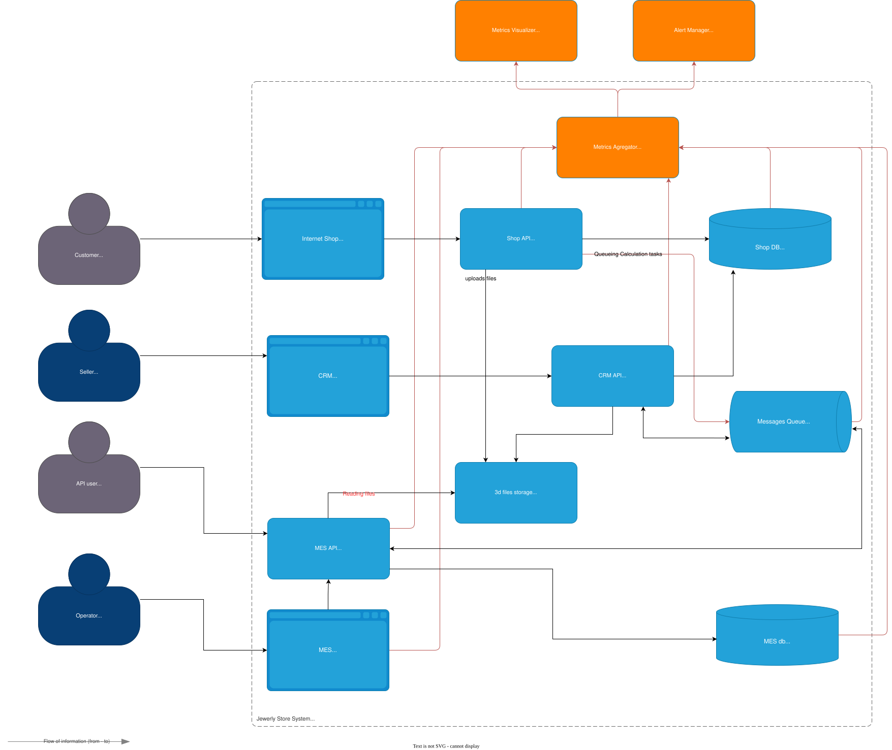

# Архитектурное решение по логированию

> Проанализируйте систему компании и C4-диаграмму в контексте планирования логирования.
> Опишите, какие логи нужно собирать и отметьте на схеме, из каких систем требуется сбор логов. Составьте список необходимых логов с уровнем INFO.
> Например, изменение статуса заказа. Логируем время, идентификатор покупателя, номер заказа.
> Напишите, будете ли вы использовать другие уровни логирования и при каких обстоятельствах

Система | Ключевые события (INFO) | Почему важно
-|-|-
Shop API | `ORDER_SUBMITTED`, `FILE_UPLOADED`, `CALL_MES_QUEUE_PUBLISHED`, `4xx/5xx результаты` | Начало жизненного цикла заказа, рост нагрузки от B2B‑API
MES API + workers | `PRICE_CALCULATION_STARTED`/`FINISHED`, `MANUFACTURING_STARTED`/`COMPLETED`, `FILE_ID`, `время расчёта` | Самый длинный и дорогой шаг; нужен SLA
CRM API | `PRICE_RECEIVED`, `MANUF_APPROVED`, `ORDER_CLOSED` | Завершает жизненный цикл; важно для финансов
RabbitMQ plugins | `MESSAGE_PUBLISHED`, `MESSAGE_ACKED`, `DLQ_ROUTED` (exchange, routingKey) | Поиск потерянных сообщений
Front‑end (Vue/React) | `UI_ERROR`, `DASHBOARD_LOAD_TIME`, `OPERATOR_TAKE_ORDER` | UX‑метрики для операторов
Infrastructure | `EC2 autoscale events`, `Postgres slow‑query log` | Корреляция с инцидентами



## Мотивация

> Напишите здесь, почему в систему нужно добавить логирование и что это даст компании. Опишите три-пять технические и бизнес-метрики решения, на которые может повлиять внедрение логирования.

Метрика до / после | Как влияет логирование
-|-
MTTR (часы → минуты) | Быстрый поиск stack‑trace + order‑id
% утерянных сообщений | Отчёты по DLQ‑логам → 0 % или авто‑ресенд
Время `“SUBMITTED→PRICE_CALCULATED” p95` | Логи воркеров дают реальные цифры для оптимизации
Найденные инциденты за спринт | Растет на 30 – 40 % (корень найден по логам), со временем число инцидентов должно падать
Клиентские жалобы | Падают в количестве за сутки. Проактивные оповещения о 5xx / DLQ превышениях

> Команда не сможет реализовать единовременно логирование и трейсинг всех выделенных для этого систем. Поэтому опишите, для каких систем нужно настраивать логирование и трейсинг в первую очередь и почему.

Приоритет внедрения

- Shop API & MES API/worker — здесь возникают самые долгие задержки
- RabbitMQ — вероятно теряются/дублируются сообщения
- CRM API — финальная запись статусов, влияет на деньги клиентов
- Infrastructure & Front‑end — после стабилизации ядра

## Предлагаемое решение

> Опишите, как и с помощью каких технологий будет реализовано логирование, какие компоненты нужно внедрить или доработать. Отразите компоненты и новые связи на схеме.
> Проработайте политику безопасности в отношении логов — как будет происходить работа с чувствительными данными, кто будет иметь доступ к логам.
> Проработайте политику хранения в отношении логов — будет ли это отдельный индекс под систему, сколько они будут храниться и какого размера будут.

## Проработайте необходимые мероприятия для превращения системы сбора логов в систему анализа логов

> Нужно ли настроить какой-то алертинг?
> Нужно ли искать аномалии? Например, было четыре записи о создании заказов и за секунду их стало 10 000. Возможно, происходит DDoS-атака конкурентами.

### Алерты

```yaml
- alert: HighOrderErrors
  expr: sum(rate({event="ORDER_SUBMITTED",level="ERROR"}[5m])) > 5
- alert: DLQSurge
  expr: sum(rate({event="DLQ_ROUTED"}[1m])) > 100
```

DDoS / аномалии - алертинг

- LogQL pattern‑detector: если RPS вырос > 10× медианы за 1 мин.
- Включаем rate‑limit.

### Dashboard для анализа логов

Сбор логов в первой итерации должен быть нацелен на выявение ошибок обработки заказов (основная проблема компании в моменте):

- Error rate за час.
- Response time — время отклика системы по каждому сервису
- Drill‑down кнопка «Посмотреть trace».

## Дополнительное задание (не выполнялось)

> Проработайте критерии для выбора технологии для работы с логами и обоснуйте свой выбор через плюсы и минусы. Выделите не менее пяти критериев.

Пример:

Критерий | ELK | OpenSearch | Splunk | Что-то ещё
-|-|-|-|-
Лицензия | Elastic License | Apache License, Version 2.0 | Проприетарная | -
