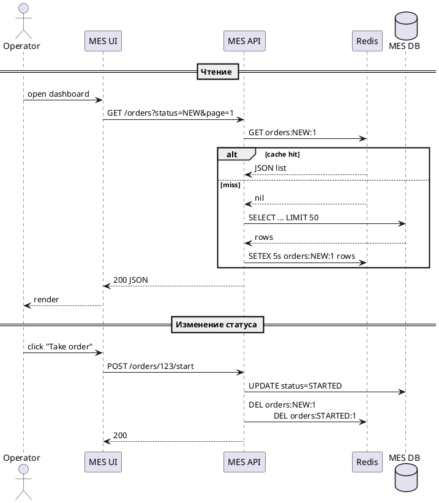

# Архитектурное решение по кешированию

## Проанализируйте диаграмму системы и её описание 

> Решите, какую часть системы имеет смысл закешировать.

Кандидат | Нагрузка | Боль | Цена неконсистентности
-|-|-|-
A. Список заказов на дашборде MES | 90 % UI‑запросов, R/O‑heavy | Страницы грузятся > 5 с | Приемлема погрешность ± 5 с
B. Результаты расчёта цены 3D‑модели | 30 мин CPU‑job, часто одинаковые модели | Повторные расчёты → перегрузка | Нет — цена должна быть идентична
C. Reference data (металлы, вставки) | Редко меняется | Сейчас читается из БД | Нулевая

## Мотивация

> Опишите здесь, почему вы предлагаете внедрить кеширование, какие проблемы оно должно решить и какие элементы системы вы планируете включить в кеширование.

Проблема | Как решает кеш
-|-
Долгая загрузка MES‑дашборда → операторы не видят новые заказы | Кешируем «Orders list by status&page» (p95 < 200 мс)
CPU‑инкубатор в MES‑воркере, дубли расчётов | Кеш результатов price_hash → cost снижает среднее время с 8 → 1 мин
Нагрузка на Postgres (read IOPS) | Redis берёт ~80 % запросов на себя
Перерасход на EC2 | −1 виртуальная машина воркеров при росте хита кэша > 70 %

## Предлагаемое решение

> Определите, какое кеширование вы будете внедрять — клиентское или серверное. Объясните, почему, на ваш взгляд, нужно использовать именно его. Если вы решите куда-то внедрить серверное кеширование, то поясните, какой паттерн будете применять — Cache-Aside, Write-Through или Refresh-Ahead. А также объясните, почему вы выбрали этот паттерн и почему остальные паттерны не подойдут или покажут себя хуже.

Часть | Вид кеша | Паттерн | Стек
-|-|-|-
MES dashboard orders list | Redis cluster | Cache‑Aside | Spring Cache, Redis 6 (Cluster)
Price calculation results | Серверный Redis (LRU) | Write‑Through + Refresh‑Ahead1 | Custom C# middleware + Hangfire job
Browser | HTTP‑cache 30 s (ETag) | — | Cache‑Control: public,max‑age=30

1 Write‑Through фиксирует консистентность, Refresh‑Ahead фоновой задачей обновляет кэш по популярным хэшам, чтобы не истекал при «горячих» моделях.

Другие паттерны кажутся не подходящими:
- Cache‑Aside для цены — риск «stampede», потребуются локи.
- Client‑side only — не спасёт операторов; API всё равно медленно отдаёт.
- Write-Behind - может приводить к ошибкам записи в БД при одновременном "взятии" заказа

## Нарисуйте диаграмму последовательности действий (Sequence diagram)

> Отобразите там, как проходит операция чтения списка заказов и запись об изменении статуса заказа. Там же опишите процесс кеширования с указанием всех сущностей, которые участвуют в кешировании. Добавьте диаграмму в раздел «Предлагаемое решение».

## Предлагаемое решение

> Опишите стратегию инвалидации кеша, которую вы планируете использовать. Объясните, какую стратегию инвалидации вы предлагаете (временную, по ключу, программную или другие), почему она подойдёт и почему не подойдут другие стратегии.
Не всегда очевидно, какое решение лучше. Чтобы выбрать оптимальный вариант, можете сделать сравнительный анализ в виде таблицы. Например, так:

Первая стратегия | Вторая стратегия | Остальные стратегии
-|-|-
Лучше подходит, потому что... Есть особенности: 1)... 2)... Позволяет сделать... Не позволяет сделать... | ... | ...

## Дополнительное задание

> Если вы считаете, что может быть несколько решений и вам сложно выбрать между ними, можете описать несколько вариантов. В таком случае в разделе «Предлагаемое решение» запишите как минимум два решения и подготовьте сопоставление в виде таблицы. Например, так

Пункты сравнения | Решение 1 | Решение 2
-|-|-
Описание решения и его диаграмма | |
Плюсы решения | |
Минусы решения | |